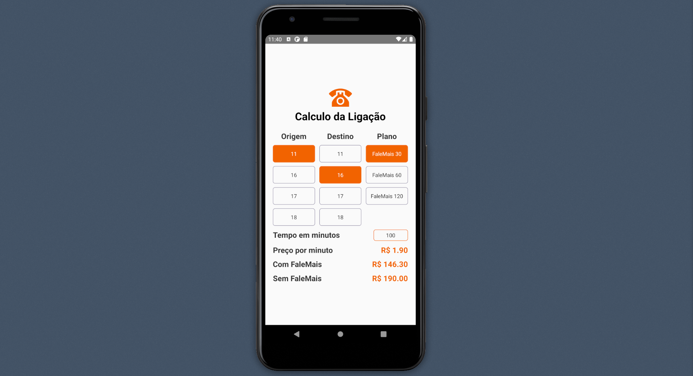

<h1 align="center">
  Interface mobile do Desafio
</h1>

<p align="center">
  
</p>

## :rocket: Tecnologias

-  [React Native](https://reactnative.dev/)
-  [TypeScript](https://www.typescriptlang.org/)
-  [Styled Components](https://styled-components.com/)
-  [React Native Vector Icons](https://github.com/oblador/react-native-vector-icons)

## 📥 Instalação e execução

``Obs: Para desenvolvimento desta aplicação foi utilizando o Android Studio, portanto, a aplicação só foi devidamente testa no ambiente android, mais especificamente no Android 9.0(Pie)``

```bash
# Acessando o diretório
$ cd mobile/

# Instalando as depedências
$ yarn install

# Configurando no mobile
$ yarn android

# Executanto aplicação
$ yarn start
```
