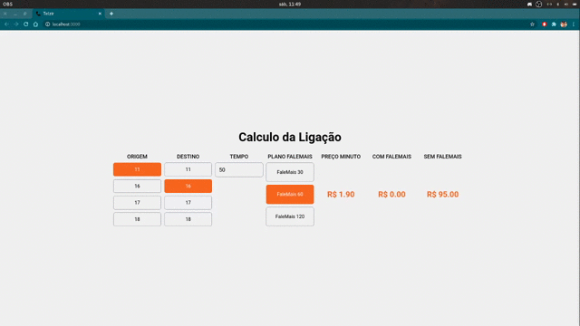

<h1 align="center">
  Interface web do Desafio
</h1>

<p align="center">
  
</p>

## :rocket: Tecnologias

-  [Typescript](https://www.typescriptlang.org/)
-  [React](https://pt-br.reactjs.org/)
-  [Styled components](https://www.styled-components.com/)

## 📥 Instalação e execução

```bash
# Acessando o diretório
$ cd web/

# Instalando as depedências
$ yarn install

# Executanto aplicação
$ yarn start
```
